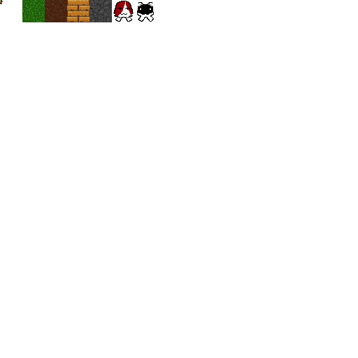

# Wawacraft: Evolved


Wawacraft:Evolved is a 3D voxel-based survival-sandbox game programmed in C++ and 
OpenGL with a goal of creating a technically & artistically impressive sequel to 
the original game: Wawacraft(or how I like to refer to it as of now, due to its 
age: Wawacraft Classic). It is also - much like its predecessor - a game with a focus 
on earless cats, silly ideas, and pure lopsided fever-dream fun.

Playable characters will include: Wawa, Uni, Floppa, and Ploobie.

The game is intended to have an offbeat crafting system, a charm system, RPG elements 
such as special skills and levels, multiple bosses to play through, and even the idea 
of LAN multiplayer, or global multiplayer over the Internet?

> [!NOTE]
> This project and its predecessor are licensed under the GNU GPL-3.0 License, with further 
> versions to be released also applying to it unless explicitly stated otherwise.
> Any resources(i.e. source-code, art, music) in these projects are licensed under the GPL
> unless it is found these resources originate elsewhere or from a different work. Under which
> conditions, those resources are to be treated by the license of their original distribution.

## Progress with the game

Wawacraft:Evolved is a game that remains in progress, with its initial development 
beginning since around the beginning of August circa 15/8/24 . It will almost never 
be set for release, however I plan to give the game several development/release 
stages:

* Alpha 
* Beta
* Delta
* Gamma
* Sigma
* The whole rest of the greek alphabet

Was this just for the funny idea that a game be versioned Sigma 2.2.0? Yes. Very Much So.

## Current Version

Wawacraft:Evolved's newest public version is v0.2.12-alpha, Alpha 0.2.12, and has been 
given the v0.2.11's codename, Wawacraft:Evolved Spark Release, a nod to the early naming 
conventions that gave us the Wawacraft Classic Ember Release.

The codebase contains now:

 - A proper chunk management system added in for support with the Wawacraft:Evolved engine.
 - A working system to use spritesheets for textures in chunks, which I devised on my own,
   again built-in to the Wawacraft:Evolved engine.
 - Numerous optimizations to make the game work on low end systems (backface culling, unloading
   out of distance chunks from memory, lazy chunk loading, hidden face culling)
 - A series of patches to improve upon previous bugs from the v0.0.1 release of Wawacraft:Evolved
   engine.
 - A complete rewrite of the old v0.0.1-alpha engine, which I planned to release as v0.1.1-alpha,
   but I think it matters not, right? I didn't call it a major release because I still used the
   same engineering ideas as the older version, so I stacked it in minor releases.
 - A fresh new set of textures for Wawa and Uni, as well as textures for grass, stone, soil,
   and wood!!!
 - A rudimentary terrain generation system that just makes random chunk heights for every chunk
   and flat land, giving a natural-ish kind of look.
 - Block placing and deletion through DDA Algorithm variant for raycasting(Amantides and Woo).

## Performance

The game runs at an estimate 60FPS on Intel Celeron B820(1.7GHz), 4GB Ram, Integrated graphics.
I assure you that it will run relatively well on your system, however bad I am at memory management.
In the future I will try to optimize the game a bit further and make it run well.

## Installing the game

This game is built to run on a Linux environment, under the XOrg windowing system, with OpenGL 
drivers for OpenGL 3.3 minimum. It relies on glibc, GLFW, GLAD, and stb-image as dependencies at the 
moment. The project also compiles with GNUMake. The other notable "dependencies" include the handwritten 
math library that the game uses, all built in. Make sure to install the right dependencies for the 
project from the package manager of your distribution of Linux.

If you would see it useful to port the project to another platform, please feel free to send me a pull 
request for said platform, so long as we still support the original environment.

To install the game, run the following commands in a POSIX terminal. I personally use bash.

```bash
user $ git clone https://www.github.com/sphurlsmith/wawacraft-evolved
user $ cd wawacraft-evolved
```

Then look through the makefile and alter for your preferences, then compile with make.
Currently the default build is wawacraft_evolved.

```bash
user $ make
```

Finally, to run the game, run this from the project directory:

```bash
user $ cd bin
user $ ./wawacraft_evolved
```

Enjoy!

### Controls & configuration

WASD for movement
Arrow keys for rotation
TAB to switch block types
BACKSPACE for mining blocks
ENTER to place a block

If you see the game load in with settings not to your preference, such as 
fast rotation/movement/small blocks/ other such things, the code has been 
written clearly, and you can go into source code and edit environment variables 
to your liking, fiddle with it and such.

Then, of course, run ```make``` in your terminal and try the game again.

The game is built so that you can alter it to your liking. If my textures are not 
nice, create a new spritesheet in tex/ folder, and source it in main.cpp, then run 
```make```.

Remember: Every copy of Wawacraft:Evolved is personalized.

## Milestones to reach

What I plan to add in the future:

 - Fixing up the chunk management system up to the coding standards of the other classes and
   functionalities.
 - A nice-looking noise function for hills in the terrain.
 - Ponds, rivers, and lakes.
 - Mountains
 - Structures like trees, and perhaps assorted Wawa shrines and Uni shrubs?
 - Collision and physics systems
 - A legitimate system for holding game operation and controls all in one. I think that the controls
   system is very rudimentary and could be expanded upon, and I haven't even touched collision nor
   physics. This system could hold game states/modes of operation where it moves on a certain loop.
 - Either text rendering windows that are run by the same program, or a GUI system to run INSIDE the
   OpenGL framebuffer of the game.

Here are some nice development screenshots which I did not take during development at all! They are 
all here, and come alongside all the development screenshots recorded in previous versions:


And here is the full set of textures in the game if you want to take a curious gander:




## The Original Wawacraft

The original game Wawacraft Classic is available in its latest distribution flavour, 
Lockhart and Tuxhart for Windows and Linux respectively.

Visit the following link to have a quick play through the original game:
[https://sphurlsmith.itch.io/wawacraft]

## Links and Contacts

Visit the following link for my website, where I talk about all my projects in general.
[https://sphurlsmith.neocities.org/]

And visit this page for the WCEV blog, where I talk about the game and its progress so far. 
[https://sphurlsmith.neocities.org/projects/wawacraft_evolved.html]

Email me here for contacts, hellos, and discussions. I'd love to find another person 
who is just as passionate about this earless cat minecraft-clone as I am:
<sphurlsmith@gmail.com>

Much love! :3
