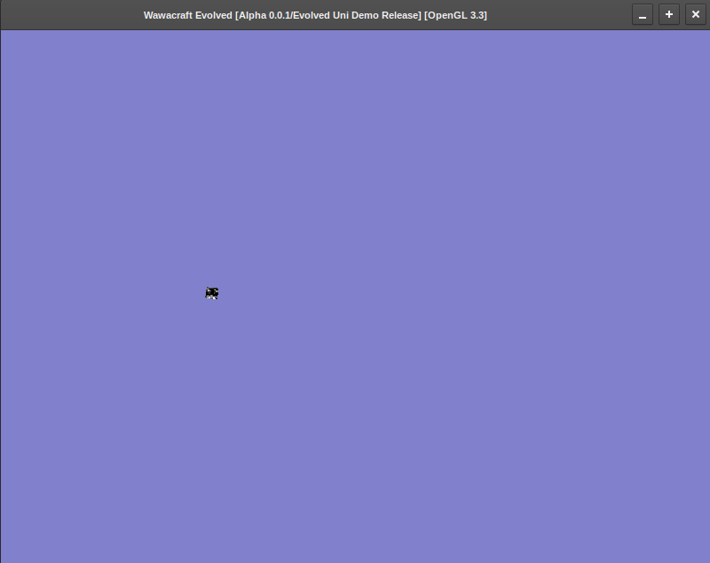

# Wawacraft: Evolved

Wawacraft:Evolved is a 3D voxel-based survival-sandbox game programmed in C++ and 
OpenGL with a goal of creating a technically & artistically impressive sequel to 
the original game: Wawacraft(or how I like to refer to it as of now, due to its 
age: Wawacraft Classic). It is also - much like its predecessor - a game with a focus 
on earless cats, silly ideas, and pure lopsided fever-dream fun.

Playable characters will include: Wawa, Uni, Floppa, and Ploobie.

The game is intended to have an offbeat crafting system, a charm system, RPG elements 
such as special skills and levels, multiple bosses to play through, and even the idea 
of LAN multiplayer, or global multiplayer over the Internet?

> [!NOTE]
> This project and its predecessor are licensed under the GNU GPL-3.0 License, with further 
> versions to be released also applying to it unless explicitly stated otherwise.
> Any resources(i.e. source-code, art, music) in these projects are licensed under the GPL
> unless it is found these resources originate elsewhere or from a different work. Under which
> conditions, those resources are to be treated by the license of their original distribution.

## Progress with the game

Wawacraft:Evolved is a game that remains in progress, with its initial development 
beginning since around the beginning of August circa 15/8/24 . It is currently not 
set for release, however I plan to give the game several development/release stages

* Alpha 
* Beta
* Delta
* Sigma

Was this just for the funny idea that a game be versioned Sigma 2.2.0? Yes. Very Much So.

## Current Version

As of now, the current version is **v0.0.1 Alpha**, also codenamed as the **Evolved Uni Demo
Release**. Current features include:  

* Added vertical and horizontal rotation
* Added semi-working movement using WASD and arrow keys
* Fixed numerous bugs with the view matrix
* Made the wawa cube an uni cube, and made it rotate.

TODO for the next version:

* Fix 'cursed boots' bug where horizontal rotation is either very fast or nonexistent
  when running the game sometimes
* Rewrite/refactor EVERYTHING going into the next version
* Fix the math-related code for the view matrix

Going into the next version(v0.1.1 alpha) however, I will be making a big rewrite of the
entire project to uphold new standards for the source code(correct naming conventions,
thought out software architecture, better file structures, etc.). If you want information
on the project, consider reading my blog, listed below.

## Screenshots

This section provides a gallery for some cool screenshots taken during development:

## The Original Wawacraft

The original game Wawacraft Classic is available in its latest distribution flavour, 
Lockhart and Tuxhart for Windows and Linux respectively.

Visit the following link to have a quick play through the original game:
[https://sphurlsmith.itch.io/wawacraft]

## Links and Contacts

Visit the following link for my website, where I talk about all my projects in general.
[https://sphurlsmith.neocities.org/]

And visit this page for the WCEV blog, where I talk about the game and its progress so far. 
[https://sphurlsmith.neocities.org/projects/wawacraft_evolved.html]

Email me here for contacts, hellos, and discussions. I'd love to find another person 
who is just as passionate about this earless cat minecraft-clone as I am:
<sphurlsmith@gmail.com>

Much love! :3
